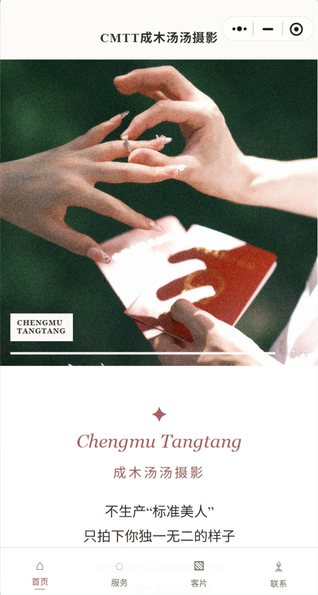
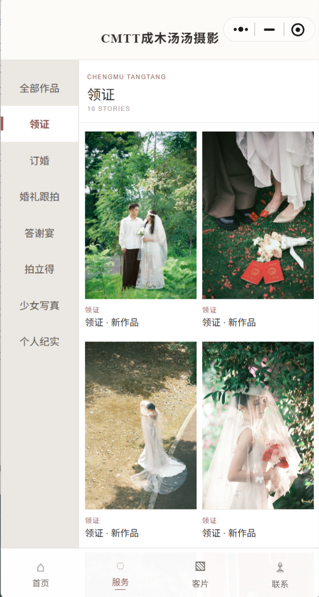
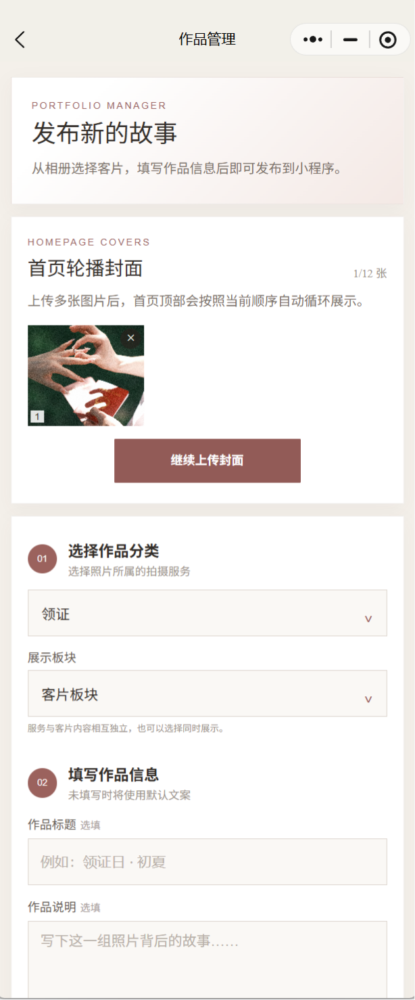

# 📷 Codex-WeChatMiniprogram-Photography-Portfolio

A professional photographer portfolio WeChat Mini Program built with OpenAI Codex.

基于 OpenAI Codex 从需求分析、代码生成到功能优化完成开发的微信摄影师作品集小程序。

## ✨ Project Overview

本项目是一款面向摄影师的微信作品集小程序，用于展示摄影作品、管理作品分类，并支持在线上传和编辑作品内容。

该项目完整记录了使用 AI Coding 工具（OpenAI Codex）辅助软件开发的全过程：

> Requirement → Architecture → Code Generation → Debugging → Optimization → Deployment

项目目标：

- 为摄影师提供一个轻量、美观的移动端作品展示平台；
- 探索 AI 辅助开发在真实软件项目中的应用流程；
- 提供一个完整的微信小程序 + 云开发 + AI Coding 开源案例。

---

# 🎯 Features

## 🏠 Homepage

- 摄影师个人主页展示
- 自定义首页封面图片
- 精选作品展示
- 服务内容展示

## 📷 Portfolio Management

支持：

- 创建摄影作品集
- 上传多张作品图片
- 编辑作品信息
- 删除作品
- 调整作品排序
- 设置作品分类

## ☁️ Cloud-based Storage

基于微信云开发：

- 云数据库存储作品信息
- 云存储管理图片资源
- 云函数处理业务逻辑

## 📱 Mobile Optimization

针对微信生态设计：

- 原生微信小程序框架
- 移动端浏览体验优化
- 图片展示性能优化

---

# 🖼️ Demo Preview

## Homepage

## Portfolio Display

## Upload & Edit

---

# 🏗️ System Architecture

